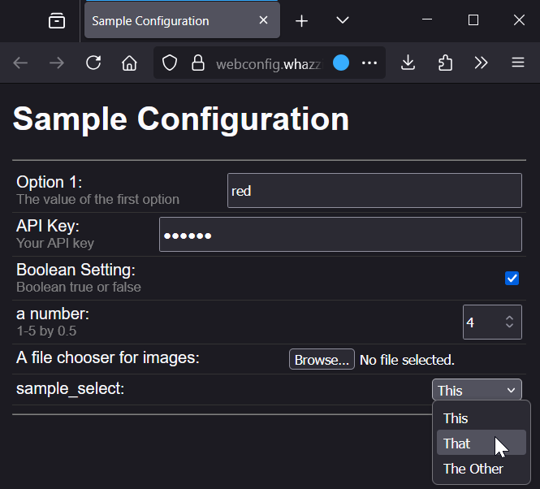

# Web Configurator for Streamer.bot Extensions

This Streamer.bot utility lets extension authors add a browser-based UI to their extension, giving their users an easier way to set up and configure their extension. It is an alternative to telling them to add or edit `Set Argument` subactions, or to code a custom Windows UI with WinForms or WPF.



### Why Use It?

* You want a nice UI for configuration, but you don't know how or want to create a DLL for Windows UI.
* Your extension contains an action for users to modify configuration in Set Argument's, but they get overwritten when they import new versions.
* HTML UI's are cross-platform, working equally well on Linux and Mac, and Windows
* Independent of the Windows UI framework du jour, so works equally well across versions of Streamer.bot

### Why Not Use It?

* Adds a dependency on the WebSocket server, which not all users may have set up. If the configurator can't connect, it will pop up a help page to guide the user through setting it up, but nothing is foolproof.
* You don't want your configuration kept in Streamer.bot global variables.
* Your configuration data is too complex to represent as a set of individual values.

## Usage for Users

When a user installs your extension, they will:
* Run a particular action in a way that you specified in your instructions. OR, you can use the autorun feature of export/import to automatically run the configuration action. This action will...
* ... bring up your extension's configuration page in their default browser.
    * The user's websocket server will need to be running
    * If they aren't, or aren't using the default websocket server settings, then they will be greeted with a page to enter the correct settings, with help to guide them..
* They will edit the configuration options, which take effect immediately.

(image here)

## Developer Usage

To include the Web Configurator UI in your extension:

1. Import the [WebConfigurator.sb](https://raw.githubusercontent.com/WhazzItToYa/Streamerbot-WebConfigurator/refs/heads/main/WebConfig.sb) into your Streamer.bot
2. As a part of your extension, create a configuration action that the user can invoke (e.g., via a Test trigger). In that action, add the subactions:
    * Set Argument "configSpec" to "{your json config descriptor}" (see below for what this looks like)
    * Run Action "WC - Open Configuration"
3. When your extension needs the user's configuration values, use the [Get Global](https://docs.streamer.bot/api/sub-actions/core/globals/global-get) subaction or the C# `CPH.GetGlobalVar` function to fetch its value.

When your user runs this action, it will open their browser to a page that allows them to edit all of the configuration options you specified. There is an example configuration action in the WebConfigurator import.

## The Configuration Descriptor

You specify the editable options of your extension in a JSON document. This document defines each configuration option that the user may edit.  Each object in the "options" array corresponds to one Streamer.bot global variable containing some piece of configuration data of your extension.

```javascript
{
    "title" : "Title of your Extension"
    "options" : [
        {
            "name" : "welcomeMessage", // S.bot variable name
            "type" : "text" | "password" | "number" | "bool" | "select" | "file",
            
            "label" : "Welcome message",           // Label to display (optional, defaults to "name")
            "description" : "New viewer greeting", // small help text (optional)
            "default" : "Welcome to the stream!",  // Initial value (optional)

            // Other options depending on "type":
            
            // For "number" type:
            
            "min" : 5,  // (optional) smallest number you can configure
            "max" : 10, // (optional) largest number you can configure
            "inc" : 0.5, // (optional) Allowed increments of the number
            
            // For "select" (i.e., dropdown list)
            
            "values" : [
                        "value1",     // First dropdown
                        "value2",     // Second dropdown
                        ["value314159", "pi"] // Third dropdown, Displays "pi" to user, but the stored value is "value314159"
                       ],

            // For "file" (a file picker)

            "accept" : "image/*,video/*,.webp", // The extensions or mime types to filter by
                       
        },
        ... more options ...
    ]
}

```

Example JSON: 

```json
{
    "title" : "Title of your Extension"
    "options" : [
        {
            "name" : "sample_aString",
            "type" : "string",
            "label" : "Option 1",
            "description" : "The value of the first option",
            "default" : "red"
        },
        {
            "name" : "sample_password",
            "type" : "password",
            "label" : "API Key",
            "description" : "Your API key"
        },
        {
            "name" : "sample_bool",
            "label" : "Boolean Setting",
            "description" : "Boolean true or false",
            "type" : "bool",
            "default" : "true"
        },
        {
            "name" : "sample_number",
            "label" : "a number",
            "description" : "1-5 by 0.5",
            "type" : "number",
            "min" : "1",
            "max" : "5",
            "inc" : "0.5",
            "default" : 4
        },
        {
            "name" : "sample_users",
            "label" : "Shoutout Users",
            "description" : "The usernames of those who get auto shoutouts",
            "type" : "list",
            "options" : [ ]
        },
        {
            "name" : "sample_file",
            "type" : "file",
            "label" : "A file chooser for images",
            "accept" : "image/*"
        },
        {
            "name" : "sample_select",
            "type" : "select",
            "values" : [
                "This", "That", ["other", "The Other"]
            ]
        }

    ]
}
```

To see what this looks like in action, visit [Sample Configuration Page](https://webconfig.whazzittoya.com/?configUrl=sample.json)

## The Future

### Help Creating Config JSON.

To set the JSON in an argument, you have to strip all the newlines. This is annoying. If you want to change it later, you probably will need to restore newlines & indenting, edit it, then strip them again. This is even more annoying. The tool should provide an editor to update the JSON & get it into streamer.bot.

## Contact Info

For bug reports, or feature requests, [open an issue](https://github.com/WhazzItToYa/Streamerbot-WebConfigurator/issues).

For questions or help, drop a message into the [Discord post](https://discord.com/channels/834650675224248362/1390507952833822781).
